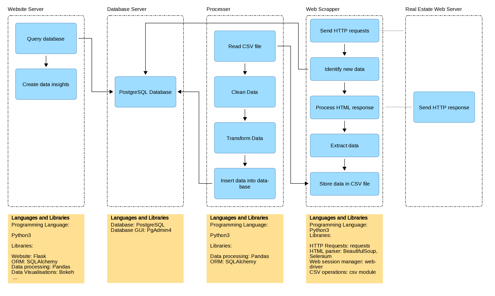
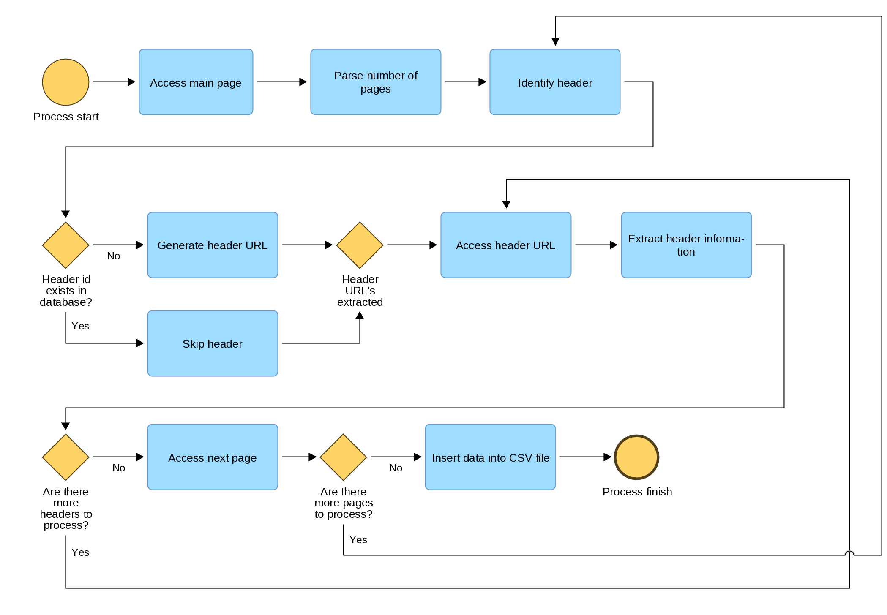
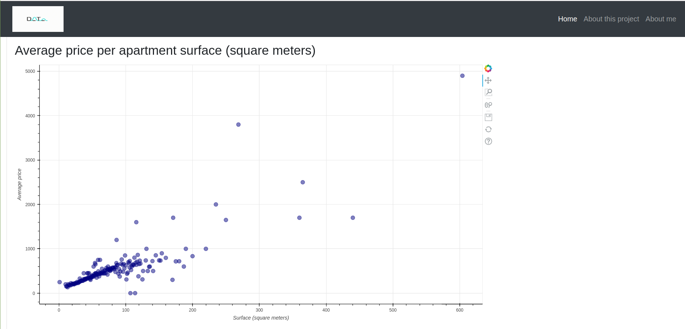
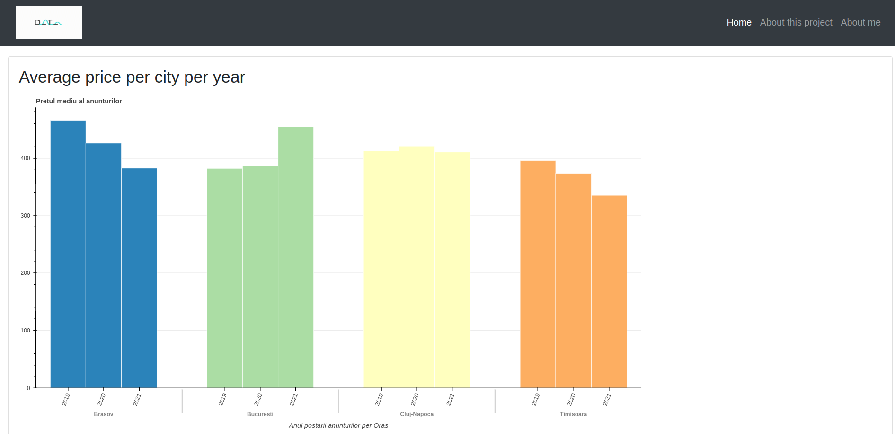

# Real Estate Web Scrapper
## Automatically extracting data from real estate websites

### Introduction
This python project implements an ETL (Extract-Transform-Load) process in the domain of real estate (rented apartments) using as source data two popular romanian websites:
* www.imobiliare.ro
* www.storia.ro

### Data
Information is extracted both from main pages and individual headers:
* header_id
* number of rooms in the apartment
* apartment surface (square meters)
* apartment compartment structure
* location (city and city region)
* price and price currency
* floor
* header_date
* source
* parking_space (Yes/No)
* balcony (Yes/No)
* seller_type (individual, agency, construction companies)
* apartment construction_year

### High-Level Design

### Data Extraction Process

### Data Transformation

Once raw data is extracted into csv_files grouped based on the city or region of the rented apartments, the programs called "processers" are cleaning the data with the use of Pandas library.
* Remove whitespace
* Segment or combine data
* Replace words
* Regex expressions

### Data storage
After the cleaning process, the data is inserted into a PostgreSQL database, which for this project is stored locally.

### Data visualisations

Using Flask, Bokeh libraries and bootstrap, a website was created in order to create data visualisations:

### Workflow Orchestration

With the use of Apache Airflow library, programs are scheduled, orchestrated and monitored with the use of DAGS.

